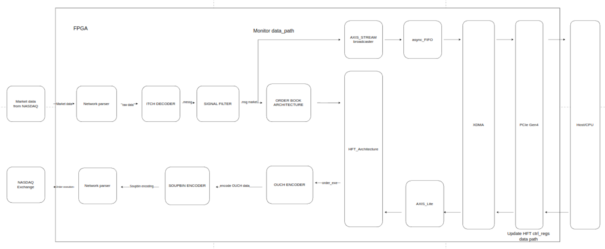

# HFT_sim

## Project Overview
> Implemented a low-latency High-Frequency simulation (HFT) with Alinx AX735 FPGA and 10G Ethernet, integrating custom UDP/TCP stack and MAC controller, ITCH/OUCH parser for market data and order execution

<!-- 


 -->


<p align="center">
  <em>Figure 1: Architecture diagram</em>
</p>

---

## 📖 Table of Contents
- [About](#-about)
- [Features](#-features)
- [Installation](#-installation)
- [Usage](#-usage)
- [Screenshots](#-screenshots)
- [API Reference](#-api-reference)
- [Contributing](#-contributing)
- [License](#-license)
- [Contact](#-contact)

<!-- --- -->

<!-- ## 📌 About
> This project is an implication of high-performance FPGA-based with customized TCP/IP stack optimized for high-frequency trading, designed to minimize latency and maximize throughput. -->

---

## ✨ Features
- ✅ Ethernet MAC controller for AMD 10G Ethernet PCS/PMA
- ✅ Lightweight IPv4 parsing header
- ✅ UDP transmitter (TX)
- ✅ UDP transmitter (RX)
- ✅ TCP out of order message receive feature
- ✅ TCP out of order duplicate ACKs fast transmission

- 🔄 ITCH 5.0 decoder
- 🔄 MoldUDP64 AXI Stream receiver
- 🔄 Soupbin TCP 3.0 message packing
- 🔄 OUCH 5.0 encoder message
- 🔄 TCP Glimpse request handler
- 🔄 TCP Glimpse response handler
- 🔄 Monitor AXIS-4 stream
- 🔄 Updating runing-time config registers
- 🔄 TCP Glimpse response handler

---

## 🖥️ Technology Stack
- **Hardware Description Language**: SystemVerilog
- **Simulation & Verification**: Verilator, GTKWave
- **Target Protocols**: IPv4, UDP, TCP
- **Future Protocols**: MoldUDP64, ITCH, SoupbinTCP 3.0, OUCH

---

## 🖥️ Project structure
```
├── doc/      
├── rtl/                # All RTL source code (System Verilog)
│ └── top.sv          # Top-level design file
│ └── ether_simulation.sv          # simulation of client and sever
├── tb/                 # All testbench code 
```

## 🛠 Installation
**Requirement:**
- verilator 5.037
- gtkwave
- python3

**Clone the repository:**
git clone https://github.com/USERNAME/REPO.git

**Run the simulation**
make ether_simulation.wav


